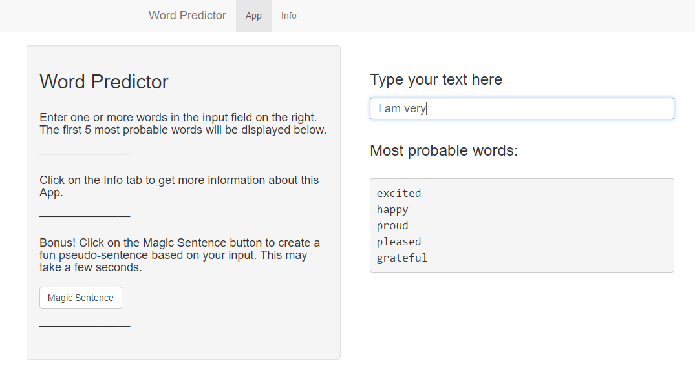

My Word Predictor
====================================================
author: mtotolo
date: 10/06/16

The Project
========================================================

The aim of this project is to create an app capable of predicting the correct word (output) 
given a set of words (input). To this end, a dataset (part of the HC Corpora) 
has been provided for training the predictive model.

The following steps have been executed:
- analyze and pre-process the training dataset
- build different representation models
- quantitatively evaluate the models and pick the best one
- build and deploy an app implementing the model

Representation Models
========================================================

<small>The basic model is based on an **N-gram representation** of the training set.

All the N-grams of the training set are counted and the relative frequencies are used to calculate the
probability of encountering a particular N-gram. Given N-1 words, the Nth word with the highest
probability is chosen.

The unigrams were counted first. By discarding all the unigrams under a certain freqency threshold, a **dictionary of about 25000 words** was chosed.
For each N-gram representation (N=2,3,4) three alternative models have been analyzed:
- a **basic model** as described above
- a model with a **stupid backoff** algorithm: when a particular N-grams isn't in the training set, the (N-1)-grams are used instead
- a model with stupid backoff and, additionally, a placeholder for **unknown words**. This means that the dictionary has one more word whose counts are the total sum of all words left out of the dictionary</small>

Model Evaluation
========================================================

<small>The dataset has been divided into 75% training set and 25% test set. The average response time and the accuracy of the algorithm for the best 1,3 and 5 words have been calculated.

***

The best algorithm turns out to be the one implementing the 4-gram backoff with the unknown word placeholder (accuracy > 67% considering the first 5 predicted words).

Although training and test sets are disjoint, the calculated accuracy is likely to be an optimistic estimate in the general case. This is because the dataset used comes from environments employing specific languages (social media, news).</small>

The App
========================================================

<small>A simple app implementing the prediction algorithm has been developed and can be found [here](https://mtotolo.shinyapps.io/WordPredictor/). Just type in a sentence and the five most probable next words will be displayed.

***

The algorithm can be easily deployed on other platforms. It takes a word vector of any length as input and returns a 5 word vector.

Note that that the input sentence is also pre-processed in the same way of the training set: capital words, punctuation, numbers and a selection of forbidden words are filtered out. 

Check out the Info tab for details on the implementation of the prediction algorithm and the libraries used.</small>
